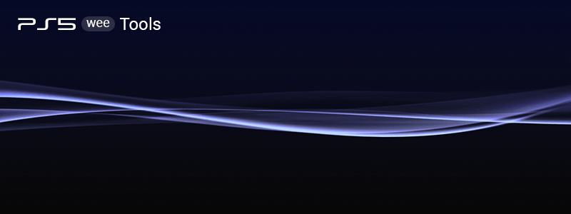

# PS5 Wee Tools

PS5 wee tools help to work with PS5 sflash dump.

Written in Python to keep it simple.

Was tested with Python 3.8

**Dependencies**

If you want to run python script directly you need these libs

(It can be easily installed with help of pip)

`pip install pyserial`

## Features

NOR tool
* PS5 Nor dump info
  * MD5, Board ID, Model, SKU, Region, SN / Mobo SN
  * Kiban ID, FW (current/min/factory), MAC (LAN/WiFi)
* Flags toggle:
  * kiosk mode (idu), model (slim/disc/digital), active slot
* Extract NOR's partitions
* Build dump from extracted files
* Basic validation

Common
* File browser
* Terminal (UART) with highlighting
* sFlash r/w (SPIway by Judges)
* Multy files compare
* Pack / Unpack 2BLS files

Don't use if you don't understand what is it for!

## Credits

[Abkarino](https://github.com/AbkarinoMHM), 
[zecoxao](https://github.com/zecoxao), 
[TheCod3r](https://www.youtube.com/@TheCod3r)

And of course [PSDevWiki](https://www.psdevwiki.com/ps5/)

## Donate

* **[Patreon](https://patreon.com/andy_man)**
* **[Boosty](https://boosty.to/andy_man/donate)**
* **[YandexMoney](https://yoomoney.ru/to/410011555252085)**
* **Bitcoin**: 39VaMnFqCQo751mvDc3M7ADVty71q2tWDm 
* **TronLink**: TSYe254HXFapEwAAbZFkTHGewezZmnCKnU

## Links

* [X/Twitter](https://twitter.com/AndyManDev)

## Changelog

### v0.1.5
* FW detection bugfix
* Slim model support
* Flags toggle: active slot
* Region #18 added
* Code optimization
* Minor bug fixes

### v0.1 - Initial release
* PS5 Nor dump info
* Flags toggle: idu, model
* PS5 dump pack/unpack
* File browser
* Terminal (UART) with highlighting
* Multy files compare
* Pack / Unpack 2BLS files

